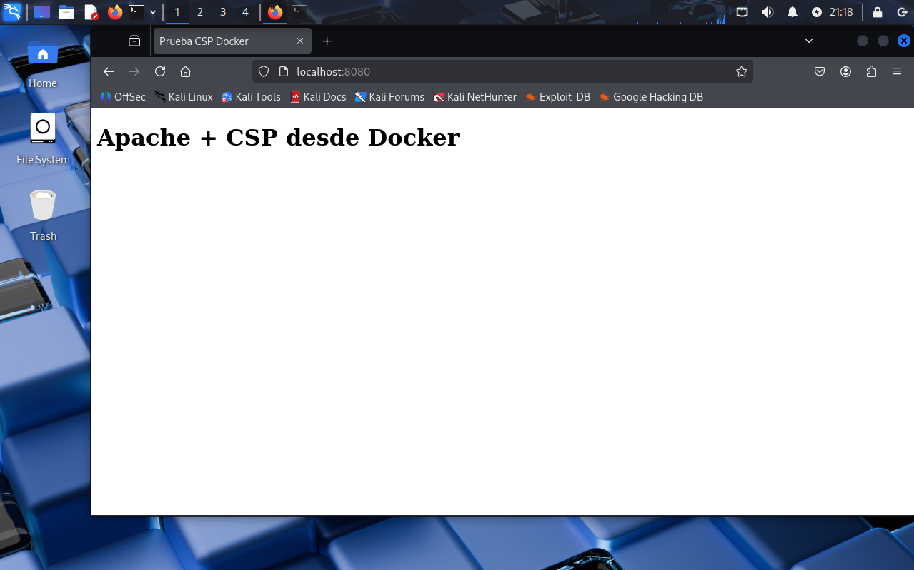

# Apache Seguro con HSTS y CSP en Docker

## Descripción
Este proyecto configura un servidor web Apache seguro dentro de un contenedor Docker, aplicando medidas de seguridad recomendadas como:

- Deshabilitar el módulo `autoindex` para evitar exposición de directorios.
- Habilitar HSTS (HTTP Strict Transport Security) para forzar HTTPS.
- Configurar CSP (Content Security Policy) para mitigar ataques XSS e inyecciones de código.

Se puede usar como base para desplegar aplicaciones web de manera más segura siguiendo buenas prácticas de seguridad OWASP.

## Estructura del proyecto

- apache.conf # Configuración principal de Apache
- Dockerfile # Archivo para construir la imagen Docker
- index.html # Página principal de prueba
- site.conf # Configuración de VirtualHost
 images/ # Carpeta donde guardar capturas de pantalla

## Requisitos
- Docker instalado en el sistema
- Certificado SSL válido (self-signed o emitido por una CA)
- Apache con módulos `headers` y `ssl` habilitados

## Instalación de la imagen

Para descargar la imagen de docker hub lo haremos con el siguiente comando
docker pull pps10711828/3.1:pr3.1.1

Después haremos un run del contenedor
docker run -d -p 8080:80 -p 8081:443 --name nombre_del_contenedor pps10711828/3.1:pr3.1.1

### Comprobación

Para mirar que funcione haremos un http://localhost:8080

