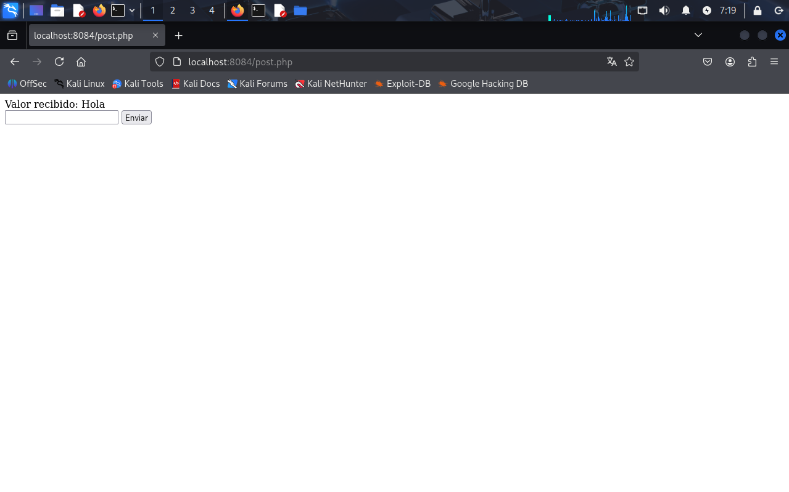
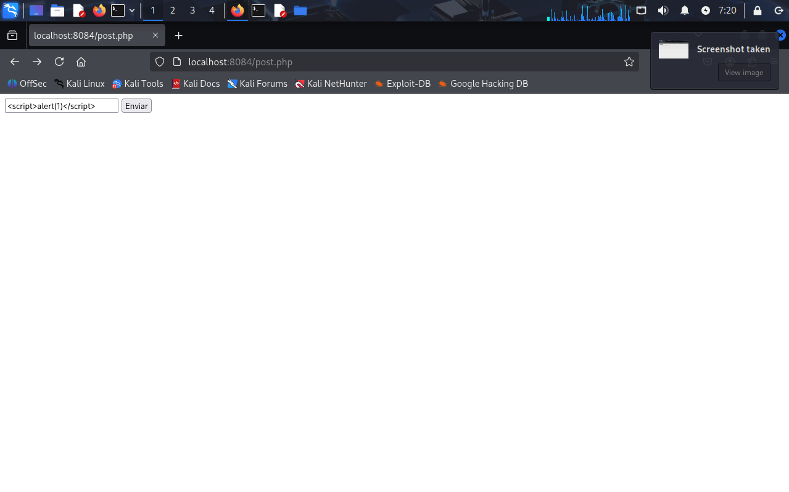
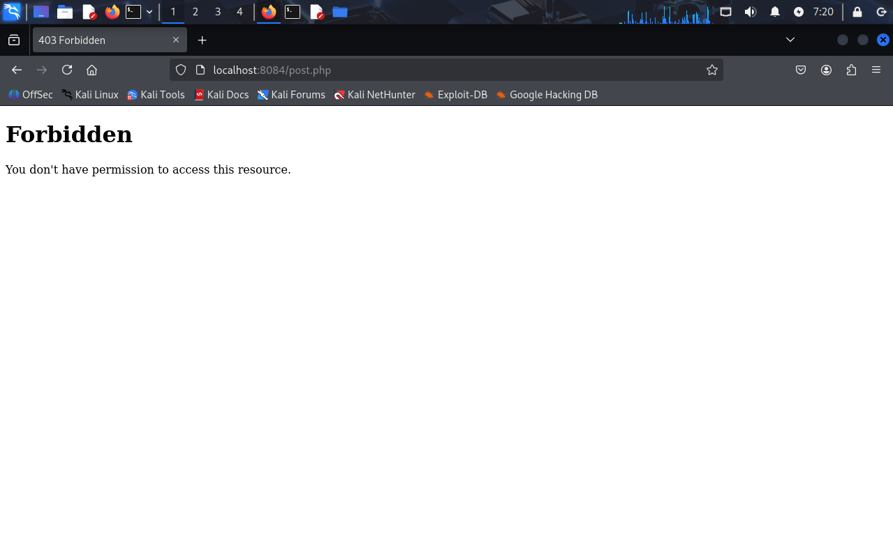

# 3.1.2 – WAF (Web Application Firewall) en Docker

## Descripción
En esta práctica se implementa un WAF (Web Application Firewall) utilizando Apache dentro de Docker.

El objetivo es añadir una capa extra de seguridad que permita:

- Detectar y bloquear ataques comunes como XSS o SQL Injection.
- Proteger la aplicación web antes de que las peticiones lleguen al servidor.
- Aplicar reglas de seguridad basadas en OWASP.

Para ello se utiliza ModSecurity como módulo de Apache.

## ¿Qué es un WAF?
Un WAF es un firewall para aplicaciones web. Analiza las peticiones HTTP y puede bloquear aquellas que considere maliciosas.

En este proyecto, el WAF protege el servidor Apache que se ejecuta dentro del contenedor Docker.

## Estructura del proyecto

- Dockerfile #Construcción de la imagen WAF
- index.html #Página de prueba
- post.php #Formulario para el funcionamiento de la práctica
- images #Carpeta donde guardar capturas de pantalla

## Requisitos
- Docker instalado en el sistema
- Módulo php instlado (viene con la imagen)

## Instalación de la imagen

Para descargar la imagen de docker hub lo haremos con el siguiente comando
docker pull pps10711828/3.1:pr3.1.2

Después haremos un run del contenedor
docker run -d -p 8084:80 8085:443 --name nombre_del_contenedor pps10711828/3.1:pr3.1.2

### Comprobación

Para mirar que funcione haremos un http://localhost:8084/post.php

Captura 1: Funcionamiento sin alertas

Captura 2: Funcionamiento con alertas

Captura 3: Forbiden por la alerta

