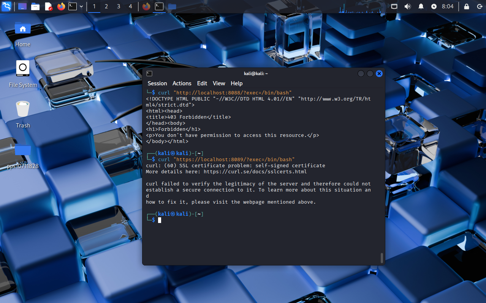

# Apache con OWASP CRS y mod_security en Docker

## Descripción
Este proyecto configura un servidor web Apache seguro dentro de un contenedor Docker, integrando **mod_security** junto con las reglas oficiales **OWASP Core Rule Set (CRS)** para proteger frente a ataques web comunes.

Se aplican medidas de seguridad como:

- Activación del motor de reglas `mod_security`.
- Instalación del conjunto de reglas OWASP CRS.
- Protección frente a ataques como:
  - Command Injection
  - Path Traversal
  - SQL Injection
  - Cross-Site Scripting (XSS)
- Registro de eventos de seguridad en los logs de Apache.

Este entorno puede utilizarse como base para desplegar aplicaciones web con una capa adicional de protección siguiendo las buenas prácticas de OWASP.

---

## Estructura del proyecto

- `Dockerfile` → Construcción de la imagen con Apache y OWASP CRS  
- `index.html` → Página principal de prueba  
- `images/` → Carpeta para capturas de pantalla  

---

## Requisitos

- Docker instalado en el sistema
- Imagen base `pps10711828/3.1:pr3.1.2`

## Instalación de la imagen

Para descargar la imagen desde Docker Hub:

docker pull pps10711828/3.1:pr3.1.3

Después haremos un run del contenedor
docker run -d -p 8088:80 -p 8089:443 --name nombre_del_contenedor pps10711828/3.1:pr3.1.3

### Comprobación

Para mirar que funcione haremos un curl "http://localhost:8080/?exec=/bin/bash"

