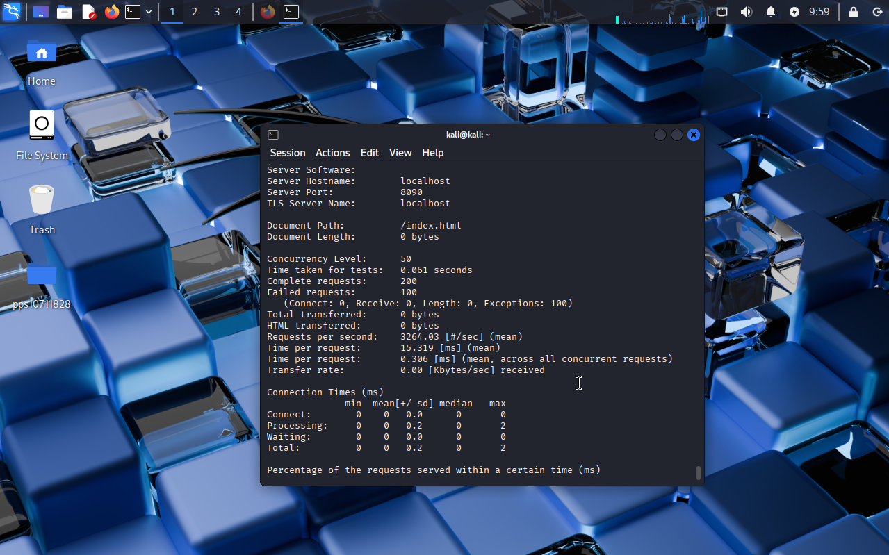

# Apache con mod_evasive (Protección DoS) en Docker

## Descripción
Este proyecto configura un servidor web Apache seguro dentro de un contenedor Docker, integrando el módulo **mod_evasive** para mitigar ataques de denegación de servicio (DoS).

Se aplican medidas de seguridad como:

- Instalación del módulo `mod_evasive`.
- Configuración de umbrales de detección de ataques.
- Bloqueo automático de IPs que superen el límite de peticiones.
- Registro de eventos en logs específicos.
- Pruebas de carga mediante Apache Bench (`ab`).

Este entorno permite comprobar cómo Apache puede defenderse frente a ataques de fuerza bruta o saturación de peticiones.

---

## Estructura del proyecto

- `Dockerfile` → Construcción de la imagen con Apache y mod_evasive  
- `index.html` → Página principal de prueba  
- `images/` → Carpeta para capturas de pantalla del test con Apache Bench  

---

## Requisitos

- Docker instalado en el sistema  
- Imagen base `pps10711828/3.1:pr3.1.3`  

---

## Instalación de la imagen

Para descargar la imagen desde Docker Hub:

docker pull pps10711828/3.1:pr3.1.4

Después haremos un run del contenedor
docker run -d -p 8090:80 -p 8091:443 --name nombre_del_conetendor pps10711828/3.1:pr3.1.4

### Comprobación

Para mirar que funcione ejecutamos el siguiente comando

ab -n 200 -c 50 https://localhost:8090/index.html

