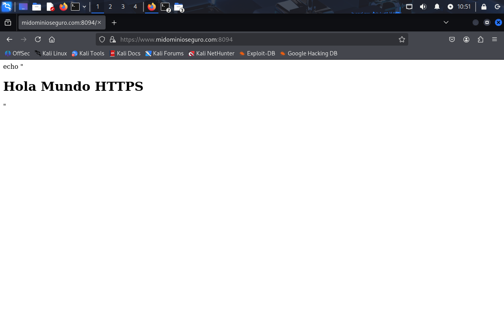

# Apache con SSL y Content Security Policy (CSP) en Docker

## Descripción
Este proyecto configura un servidor web **Apache** seguro dentro de un contenedor Docker, integrando:

- **SSL/TLS** mediante certificado autofirmado para cifrado HTTPS.  
- **Cabeceras de seguridad**: Content Security Policy (CSP) para proteger frente a ejecución de scripts o contenido no autorizado.  
- **Redirección automática** de HTTP a HTTPS.  

Se aplican medidas de seguridad que permiten proteger la aplicación web frente a:

- Cross-Site Scripting (XSS)  
- Inyección de contenido externo no autorizado  
- Carga de recursos desde dominios no confiables  

Esta imagen sirve como base segura para desplegar aplicaciones web en Apache siguiendo buenas prácticas de seguridad.

---

## Estructura del proyecto

- `Dockerfile` → Construcción de la imagen con Apache y configuración SSL/CSP  
- `apache/default-ssl.conf` → Configuración de SSL y cabeceras CSP  
- `ssl/` → Carpeta con certificado y clave autofirmados  
- `www/` → Carpeta con contenido web de prueba (`index.html`)  
- `images` → Carpeta con las imágenes

---

## Requisitos

- Docker instalado en el sistema  
- Imagen base `httpd:2.4` (descargada automáticamente durante el build)  
- Modificar el /etc/hosts añadiendo la ip del localhost pero poniendo www.midominioseguro.com

---

## Instalación de la imagen

Para descargar la imagen desde Docker Hub:

docker pull pps10711828/3.2:pr3.2.1

Después haremos un run del contenedor
docker run -d -p 9093:80 -p 9094:443 --name nombre_del_contenedor pps10711828/3.2:pr3.2.1

### Comprobación

Para mirar que funcione buscamos en el navegador 
https://www.midominioseguro.com:8094

