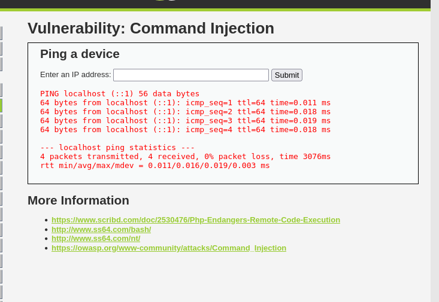
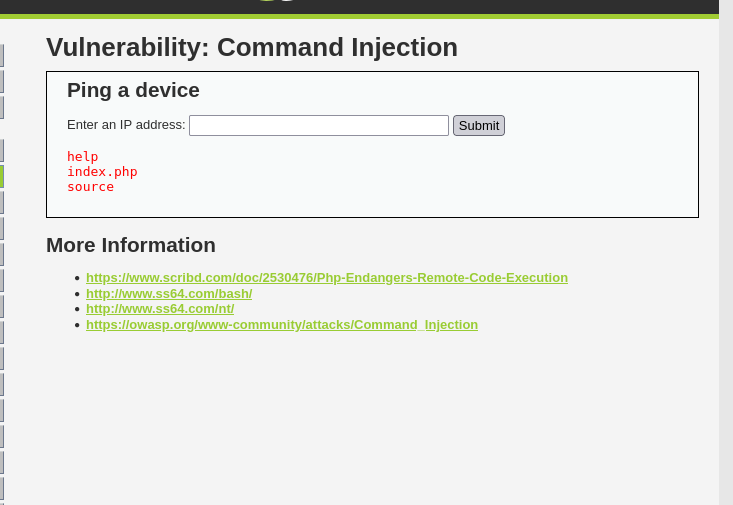

# Reporte de Explotación: Command Injection - DVWA

Este documento detalla el análisis y la explotación de una vulnerabilidad de **Inyección de Comandos de Sistema Operativo** en el módulo "Ping a device" de la plataforma **DVWA**.

---

## 🔍 Análisis de la Vulnerabilidad

La aplicación permite a los usuarios verificar la conectividad con un host remoto utilizando el comando nativo `ping` del sistema operativo.

* **Funcionamiento:** El servidor toma la entrada del usuario y la concatena directamente en una cadena de comando ejecutada por la shell (ej. `shell_exec("ping " . $target);`).
* **Falla de Seguridad:** No existe una validación o saneamiento de caracteres especiales que actúan como separadores de comandos en entornos Unix/Linux o Windows.
* **Vector de Ataque:** Uso del operador de tubería (`|`) para encadenar un segundo comando arbitrario que será ejecutado por el servidor web.

---

## 🚀 Proceso de Explotación

### 1. Comprobación de funcionamiento normal
Al introducir una dirección IP estándar como `localhost`, el sistema responde con la salida esperada del comando ping.



### 2. Inyección de comandos (Payload)
Para demostrar la vulnerabilidad, se utiliza el operador `|` (pipe), el cual toma la salida del primer comando y la pasa al segundo, o simplemente permite la ejecución secuencial si el primero falla.

**Payload:**
```bash
| ls
```

### 3. Resultados obtenidos

Al enviar el payload anterior, el servidor ejecuta el comando `ls` en el directorio actual, exponiendo la estructura de archivos del servidor web.

**Archivos detectados:**
* `help`
* `index.php`
* `source`



---

## 📊 Comparativa de Niveles

Esta técnica de inyección simple (`| ls`) es efectiva en múltiples configuraciones de DVWA debido a la falta de listas negras robustas en el código fuente:

| Nivel | Resistencia | Comportamiento |
| :--- | :--- | :--- |
| **Low** | Nula | Acepta cualquier carácter especial sin filtrar. |
| **Medium** | Baja | Filtra algunos operadores (como `&&` o `;`), pero a menudo omite el símbolo `|`. |
| **High** | Media | Implementa una lista negra más estricta, pero sigue siendo vulnerable a variaciones de sintaxis. |

---

## 🛡️ Medidas de Mitigación

Para prevenir ataques de inyección de comandos, se deben implementar las siguientes defensas:

* **Validación de Tipo (Whitelisting):** Asegurar que la entrada sea estrictamente una dirección IP válida utilizando expresiones regulares o funciones de filtrado nativas.
* **Saneamiento de Caracteres:** Utilizar funciones como `escapeshellarg()` en PHP para neutralizar caracteres que puedan ser interpretados por la shell.
* **Uso de APIs Nativas:** Evitar llamadas directas al sistema operativo (`shell_exec`, `system`, `exec`). En su lugar, usar funciones de red propias del lenguaje de programación.
* **Principio de Menor Privilegio:** Ejecutar el servicio web con un usuario que tenga permisos restringidos para evitar que un comando inyectado pueda comprometer todo el sistema.

---

> [!CAUTION]
> **Aviso:** Esta documentación tiene fines educativos. El uso de estas técnicas en sistemas ajenos sin autorización es ilegal.
