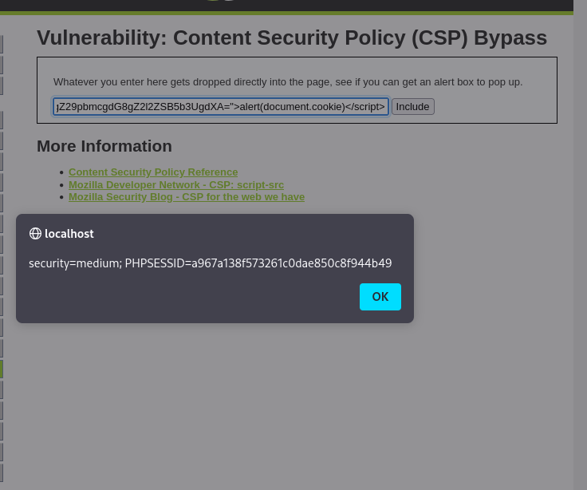

# Reporte de Explotación: CSP Bypass - DVWA

Este documento detalla el análisis y la evasión de la **Directiva de Seguridad de Contenido (CSP)** en el entorno **DVWA**, configurado en nivel de seguridad **Medium**.

---

## 🔍 Análisis de la Vulnerabilidad

En el nivel de seguridad medio, la aplicación implementa una política **CSP** que utiliza un **nonce** (número único aleatorio) para autorizar la ejecución de scripts. El objetivo teórico es que el navegador solo ejecute scripts que posean un atributo `nonce` que coincida con el enviado en la cabecera HTTP.

* **Falla de Seguridad**: El valor del nonce utilizado es **estático** (`TmV2ZXIgZ29pbmcgdG8gZ2l2ZSB5b3UgdXA=`).
* **Debilidad**: Al no regenerarse en cada petición, el atacante puede conocer el valor de antemano e incluirlo en su propio payload para engañar al navegador.
* **Consecuencia**: El navegador confía en el script inyectado porque contiene el "secreto" (el nonce) que la política CSP considera válido.

---

## 🚀 Proceso de Explotación

### 1. Identificación del Payload
Para evadir la protección, se construye una etiqueta de script que incluya explícitamente el nonce estático detectado en el código fuente.

**Payload:**
```html
<script nonce="TmV2ZXIgZ29pbmcgdG8gZ2l2ZSB5b3UgdXA=">alert(document.cookie)</script>
```

### 2. Ejecución y Resultados

Al insertar el código diseñado en el formulario, el sistema permite la ejecución del JavaScript debido a que el **nonce** coincide con el permitido por la política. Esto resulta en el robo de información sensible de la sesión (cookies), demostrada mediante una ventana de alerta.

**Captura de la Evasión Exitosa:**



---

**Datos extraídos en la captura:**

* **Security Level:** `medium`
* **PHPSESSID:** Identificador de sesión expuesto en la alerta (`a967a138f573261c0dae850c8f944b49`)

---

## 🛡️ Medidas de Mitigación

Para prevenir esta evasión y fortalecer la seguridad del sitio, se deben seguir las mejores prácticas de implementación de **CSP (Content Security Policy)**:

* **Nonce Dinámico:** El nonce debe generarse de forma aleatoria para cada solicitud HTTP individual y nunca ser un valor estático o predecible.
* **Criptografía Segura:** Es fundamental utilizar generadores de números aleatorios criptográficamente fuertes para asegurar que el valor del nonce no pueda ser adivinado por un atacante.
* **Directivas Estrictas:** Se debe reforzar la política utilizando `script-src 'strict-dynamic'` para invalidar la ejecución de scripts inyectados, incluso si el atacante logra comprometer el nonce.
* **Monitoreo:** Implementar la directiva `report-uri` o `report-to` para recibir alertas en tiempo real cada vez que una política CSP sea bloqueada o existan intentos de vulneración.

---

> [!WARNING]
> **Aviso de Seguridad:** Este reporte tiene fines exclusivamente educativos. El acceso no autorizado a sistemas informáticos sin el permiso explícito del propietario es una actividad ilegal.
