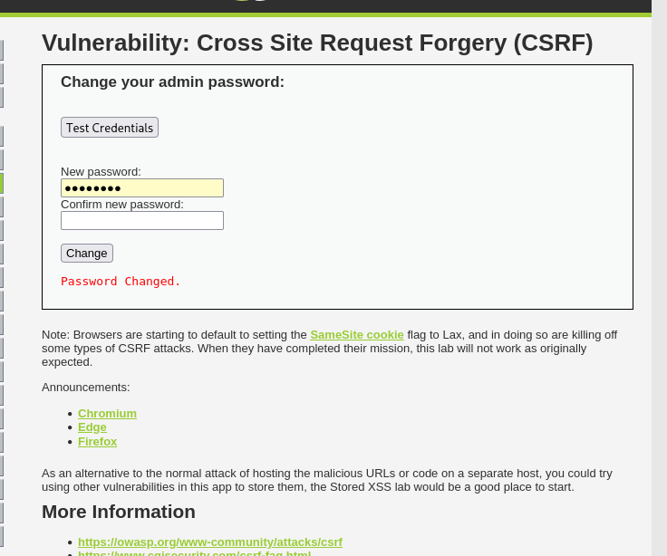

# Reporte de Explotación: CSRF Bypass (Nivel: Medium) - DVWA

Este documento detalla la explotación de una vulnerabilidad de **Cross-Site Request Forgery (CSRF)** en un entorno con seguridad media, utilizando una técnica de encadenamiento con **File Upload** para evadir las restricciones de origen.

---

## 🔍 Análisis de la Vulnerabilidad

En el nivel de seguridad **Medio**, el servidor implementa una validación básica de la cabecera `HTTP_REFERER`. 

* **Mecanismo de Defensa:** El backend verifica que la petición de cambio de contraseña provenga del mismo dominio del servidor. Esto bloquea ataques ejecutados desde sitios maliciosos externos.
* **Debilidad:** Si un atacante logra alojar el payload malicioso **dentro del propio servidor**, la cabecera `Referer` coincidirá con el dominio permitido, eludiendo la protección.

---

## 🚀 Proceso de Explotación (Chaining Vulnerabilities)

Para este ataque, se utilizó una estrategia de encadenamiento de vulnerabilidades:

### 1. Preparación del Payload
Primero, se crea un archivo llamado `csrf.php` que contiene un formulario auto-ejecutable (o un script de redirección) diseñado para enviar los parámetros de cambio de contraseña (`password_new`, `password_conf` y `Change`).

### 2. Carga del archivo (File Upload)
Para alojar el ataque en el servidor objetivo:
1. Se ajusta temporalmente la seguridad a **Low** para facilitar la subida.
2. Se utiliza el módulo **File Upload** para subir `csrf.php`.

### 3. Ejecución del Ataque
Una vez subido, el archivo está disponible en una URL interna del servidor (ej. `http://192.168.170.131/hackable/uploads/csrf.php`).

Al acceder a esta URL, el navegador envía la petición de cambio de contraseña. Como el archivo reside en el servidor local, el `HTTP_REFERER` es válido y el servidor procesa el cambio.

---

## 📊 Resultados

Al ejecutar el payload alojado internamente, se confirma la modificación de las credenciales de administrador.

* **Estado:** Password Changed (Explotado con éxito).
* **URL de ejecución:** `http://[IP-OBJETIVO]/hackable/uploads/csrf.php`

---

## 🛡️ Medidas de Mitigación

La validación del `Referer` es una defensa débil. Para una protección robusta, se recomienda:

1.  **Anti-CSRF Tokens:** Implementar tokens únicos y aleatorios por sesión que deben enviarse con cada petición sensible. Esta es la defensa más efectiva.
2.  **SameSite Cookie Attribute:** Configurar las cookies de sesión con el atributo `SameSite=Strict` o `Lax` para evitar que se envíen en peticiones transversales.
3.  **Verificación de Contraseña Actual:** Obligar al usuario a introducir su contraseña antigua antes de permitir el cambio por una nueva.
4.  **Seguridad en Cargas de Archivos:** Evitar que los archivos subidos tengan permisos de ejecución o que se almacenen en directorios accesibles vía web con extensiones ejecutables como `.php`.

---
> **Aviso:** Este contenido es estrictamente educativo. El uso de estas técnicas sin autorización es ilegal.
