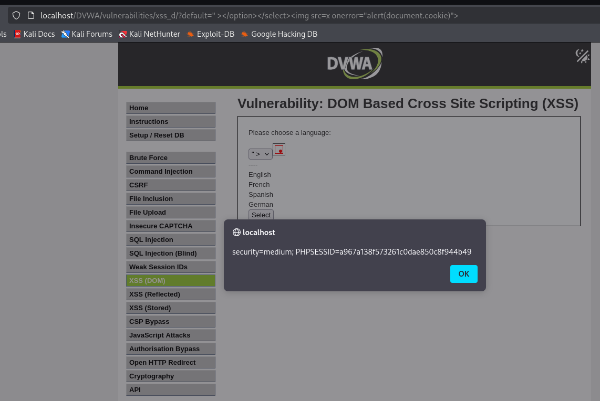

# Reporte de Explotación: DOM Based XSS (Nivel: Medium) - DVWA

Este documento detalla la identificación y explotación de una vulnerabilidad de **Cross-Site Scripting (XSS) basado en el DOM** en el entorno **DVWA**, configurado en nivel de seguridad **Medium**.

---

## 🔍 Análisis de la Vulnerabilidad

En el nivel de seguridad **Medio**, la aplicación implementa filtros básicos en el lado del servidor para bloquear la etiqueta `<script>`. Sin embargo, la vulnerabilidad persiste debido a que el parámetro `default` se refleja directamente en el DOM sin una sanitización completa.

* **El Problema**: Al seleccionar un idioma, el valor se pasa a través de la URL. El código JavaScript de la página toma este valor y lo inserta dentro de una estructura de etiquetas `<select>` y `<option>`.
* **Mecanismo de Defensa**: El servidor busca y bloquea la cadena `<script`, lo que impide los payloads de XSS tradicionales.
* **Debilidad**: El filtro no es recursivo ni bloquea otros eventos de JavaScript o etiquetas HTML alternativas como ``.

---

## 🚀 Proceso de Explotación

### 1. Evasión del Contexto (Escaping)
Para que el payload funcione, primero debemos "romper" la estructura HTML donde se inserta nuestro código. Estamos inyectando dentro de una etiqueta `<option>`, por lo que necesitamos cerrarla junto con su etiqueta padre `<select>`.

### 2. Bypass del Filtro de Etiquetas
Dado que `<script>` está prohibido, utilizamos una etiqueta `` con el evento `onerror`. Este evento se dispara automáticamente cuando el navegador intenta cargar una fuente de imagen inexistente (`src=x`).

**Payload utilizado:**
```html
" ></option></select>
```

### 3. Ejecución y Resultados

Al inyectar el payload en el parámetro `default` de la URL, el DOM se reconstruye de forma maliciosa. El navegador cierra el menú desplegable prematuramente e inserta la imagen rota, lo que dispara el evento `onerror` y ejecuta el código JavaScript para mostrar las cookies.

**Captura de la ejecución exitosa:**



---

**Datos extraídos en la captura:**

* **Security Level:** `medium`
* **PHPSESSID:** `a967a138f573261c0dae850c8f944b49`
* **URL afectada:** `localhost/DVWA/vulnerabilities/xss_d/?default= > </option></select>`

---

## 🛡️ Medidas de Mitigación

Para prevenir ataques XSS basados en DOM, se deben aplicar las siguientes medidas de seguridad:

* **Sanitización en el Cliente:** Evitar el uso de funciones que renderizan HTML directamente como `innerHTML`. En su lugar, utilizar `textContent` para tratar la entrada siempre como texto plano.
* **Validación de Lista Blanca (Whitelisting):** Validar en el lado del cliente que el parámetro `default` coincida exactamente con uno de los valores permitidos (English, French, Spanish, German) antes de procesarlo.
* **Content Security Policy (CSP):** Implementar una política estricta que prohíba la ejecución de scripts en línea (`unsafe-inline`) y el uso de manejadores de eventos como `onerror` en etiquetas HTML.
* **Codificación de Salida:** Asegurarse de que cualquier dato proporcionado por el usuario sea codificado adecuadamente para el contexto HTML antes de ser insertado en el DOM.

---

> [!WARNING]
> **Aviso de Seguridad:** Este reporte tiene fines exclusivamente educativos. El acceso no autorizado a sistemas informáticos sin el permiso explícito del propietario es una actividad ilegal.
