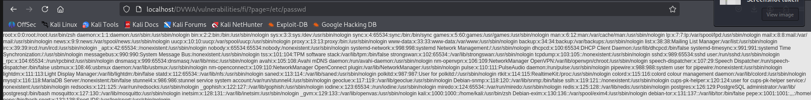

# Reporte de Explotación: Local File Inclusion (LFI) - DVWA

Este documento describe la identificación y explotación de una vulnerabilidad de **Inclusión de Archivos Locales (LFI)** en la plataforma **DVWA**, configurada en nivel de seguridad **Medium**.

---

## 🔍 Análisis de la Vulnerabilidad

La vulnerabilidad de **File Inclusion** ocurre cuando una aplicación web permite que la entrada del usuario controle qué archivo se incluye o ejecuta en el servidor.

* **Funcionamiento:** La aplicación utiliza el parámetro `page` en la URL para decidir qué contenido mostrar al usuario (por ejemplo, `include.php`).
* **Falla de Seguridad:** El backend no valida adecuadamente la ruta proporcionada, permitiendo el uso de rutas absolutas o relativas para acceder a archivos sensibles del sistema operativo que no deberían ser públicos.
* **Nivel Medium:** Aunque en este nivel se suelen implementar filtros básicos (como bloquear `../` o `http://`), a menudo es posible evadirlos utilizando rutas absolutas directas.

---

## 🚀 Proceso de Explotación

### 1. Identificación del Punto de Entrada
Se observa que la URL original carga un archivo por defecto:
`http://[IP-OBJETIVO]/vulnerabilities/fi/?page=include.php`

### 2. Ejecución del Ataque
Para demostrar la vulnerabilidad, se modifica el valor del parámetro `page` para intentar leer el archivo `/etc/passwd`, el cual contiene información sobre las cuentas de usuario en sistemas basados en Linux.

**Payload utilizado:**
`?page=/etc/passwd`

### 3. Resultados obtenidos
Al enviar la petición, el servidor incluye y renderiza el contenido del archivo solicitado directamente en la página web.

**Captura de la lectura de archivos sensibles:**

* **Impacto:** Se ha logrado extraer información crítica del sistema operativo, como la lista de usuarios, directorios personales (home) y el tipo de shell utilizado por cada uno.

---

## 🛡️ Medidas de Mitigación Recomendadas

Para prevenir ataques de inclusión de archivos, se deben implementar las siguientes defensas:

1.  **Uso de Listas Blancas (Whitelisting):** Definir una lista estricta de archivos permitidos y rechazar cualquier entrada que no coincida exactamente con ellos.
2.  **Identificadores en lugar de Nombres:** Utilizar identificadores numéricos o claves (ej. `?page=1` en lugar de `?page=contact.php`) que el servidor traduzca internamente a una ruta de archivo fija.
3.  **Configuración del Servidor (PHP):** * Desactivar `allow_url_fopen` y `allow_url_include` en el archivo `php.ini` para prevenir la inclusión de archivos remotos (RFI).
4.  **Permisos del Sistema de Archivos:** Ejecutar la aplicación web con un usuario de privilegios mínimos que no tenga permisos de lectura sobre archivos sensibles como `/etc/passwd`.

---
> **Aviso de Seguridad:** Este reporte tiene fines exclusivamente educativos. El acceso no autorizado a sistemas informáticos es una actividad ilegal.
