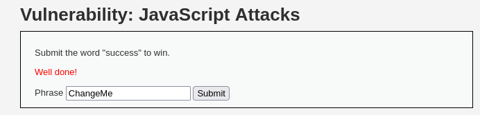

# Reporte de Explotación: JavaScript Attacks (Nivel: Medium) - DVWA

Este documento detalla el análisis de seguridad y la manipulación de lógica en el lado del cliente para evadir controles de validación en el módulo de **JavaScript Attacks**.

---

## 🔍 Análisis de la Vulnerabilidad

La aplicación solicita al usuario que envíe la frase "success" para ganar. Sin embargo, el envío está protegido por un **token** generado dinámicamente mediante JavaScript antes de que la petición llegue al servidor.

* **Comportamiento inicial**: Al enviar la frase por defecto `ChangeMe`, el servidor genera un token específico: `XXeMegnahCXX`.
* **Lógica de Ofuscación**: Al analizar el patrón del token, se observa que el valor se genera concatenando el prefijo "XX", seguido de la frase invertida y finalizando con el sufijo "XX".
    * `ChangeMe` invertido es `eMegnahC`.
    * Resultado: `XX` + `eMegnahC` + `XX`.
* **Falla de Seguridad**: La seguridad reside enteramente en el lado del cliente. Un atacante que comprenda la lógica de generación del token puede pre-calcular el valor necesario para cualquier frase y enviarlo manualmente.

---

## 🚀 Proceso de Explotación

### 1. Cálculo del Payload
Para ganar, necesitamos enviar la frase `success`. Aplicando la lógica descubierta:
1.  **Frase objetivo**: `success`.
2.  **Inversión de la frase**: `sseccus`.
3.  **Generación del token**: `XXsseccusXX`.

### 2. Manipulación de la Petición
Utilizando las herramientas de desarrollador del navegador o un interceptor (como Burp Suite), se modifica la petición para incluir los valores calculados:
* `phrase=success`
* `token=XXsseccusXX`

### 3. Resultados obtenidos
Tras enviar la petición manipulada, el servidor valida el token correctamente y devuelve el mensaje de éxito.

**Captura del resultado exitoso:**

* **Mensaje**: "Well done!".
* **Estado**: El control de lógica del lado del cliente ha sido evadido con éxito al enviar el token `XXsseccusXX` junto con la frase `success`.

---

## 🛡️ Medidas de Mitigación

Para prevenir la manipulación de lógica en el cliente, se deben aplicar las siguientes recomendaciones:

* **Validación en el Servidor**: Nunca se debe confiar en los datos o validaciones realizadas exclusivamente en JavaScript; toda lógica crítica debe verificarse en el backend.
* **Tokens de Sesión Seguros**: Los tokens de seguridad deben generarse en el servidor utilizando algoritmos criptográficamente seguros y estar vinculados a la sesión del usuario.
* **Evitar Secretos en el Cliente**: No exponer algoritmos de cifrado o generación de tokens en el código fuente visible, ya que pueden ser sometidos a ingeniería inversa fácilmente.
* **Integridad de Datos**: Implementar mecanismos de firma de mensajes para asegurar que los parámetros enviados no hayan sido alterados en tránsito.

---

> [!CAUTION]
> **Aviso de Seguridad**: Este reporte tiene fines exclusivamente educativos. El acceso no autorizado a sistemas informáticos es una actividad ilegal.
