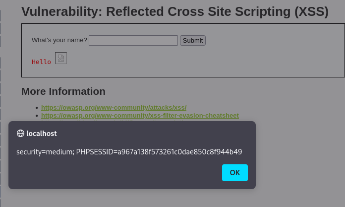

# Reporte de Explotación: Reflected Cross Site Scripting (XSS) - DVWA

Este documento detalla la explotación de una vulnerabilidad de **XSS Reflejado** en el nivel de seguridad **Medium**, demostrando que los filtros basados en etiquetas específicas pueden ser evadidos mediante el uso de eventos de etiquetas alternativas.

---

## 🔍 Análisis de la Vulnerabilidad

En el nivel de seguridad medio, la aplicación intenta mitigar el XSS eliminando o bloqueando la etiqueta `<script>` del campo de entrada.

* **Mecanismo de Defensa**: El servidor busca la cadena `<script>` y la elimina de la entrada del usuario antes de renderizarla en la página.
* **Debilidad**: El filtro es demasiado específico. No protege contra otras etiquetas HTML que pueden ejecutar JavaScript, como ``, `<body>` o `<iframe>`, ni contra el uso de controladores de eventos (event handlers).
* **Evasión**: Dado que la protección solo se enfoca en scripts tradicionales, el payload utilizado en el nivel **Low** sigue siendo efectivo si se emplean etiquetas alternativas.

---

## 🚀 Proceso de Explotación

### 1. Inyección del Payload
Se utiliza una etiqueta de imagen con una fuente inexistente (`src=x`) para forzar un error. El atributo `onerror` se encarga de ejecutar el código JavaScript malicioso cuando la imagen falla al cargar.

**Payload utilizado:**
```html

```

### 2. Resultados obtenidos

Al enviar el payload a través del formulario, el servidor lo refleja en el cuerpo de la página. El navegador intenta cargar la imagen, falla al no encontrar la fuente (`src=x`), y ejecuta inmediatamente el controlador de eventos `onerror`, lanzando la alerta con las cookies de sesión.

**Captura de la ejecución exitosa:**



---

**Datos extraídos en la captura:**

* **Security Level:** `medium`
* **PHPSESSID:** `a967a138f573261c0dae850c8f944b49`
* **URL afectada:** `localhost/DVWA/vulnerabilities/xss_r/?name=`

---

## 🛡️ Medidas de Mitigación

Para prevenir ataques de XSS reflejado de manera efectiva, se deben implementar las siguientes prácticas de seguridad:

* **Codificación de Salida (Output Encoding):** Convertir caracteres especiales como `<`, `>`, `&`, `"`, `'` en sus entidades HTML equivalentes antes de mostrarlos en el navegador. Esto evita que el navegador los interprete como código ejecutable.
* **Validación de Entradas:** Implementar filtros de lista blanca que solo permitan caracteres o formatos esperados (ej. solo letras y espacios para un nombre).
* **Content Security Policy (CSP):** Configurar una política que desabilite la ejecución de scripts en línea (`unsafe-inline`) y restrinja las fuentes desde las cuales se pueden cargar recursos.
* **Uso de Funciones Seguras:** En el desarrollo, preferir el uso de propiedades como `textContent` en lugar de `innerHTML` para manipular datos del usuario en el DOM.

---

> [!WARNING]
> **Aviso de Seguridad:** Este reporte tiene fines exclusivamente educativos. Realizar pruebas de penetración sin consentimiento es una actividad ilegal.
