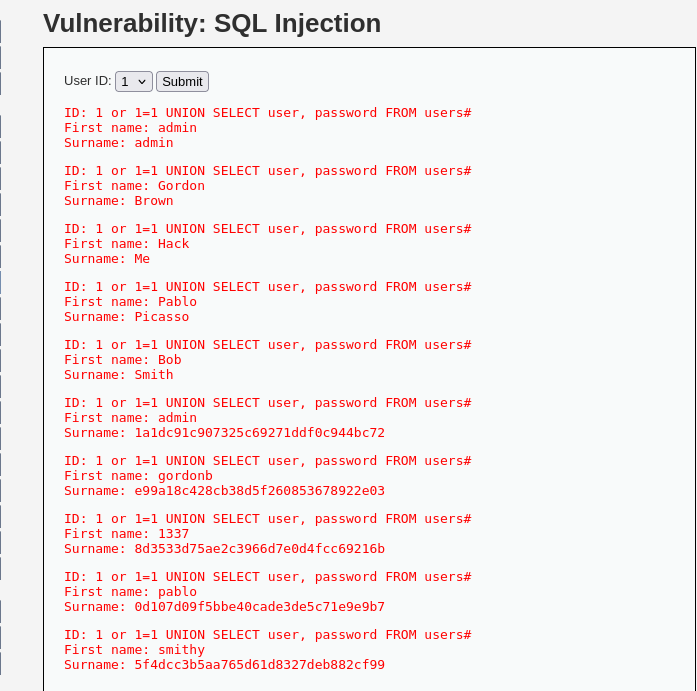

# Reporte de Explotación: SQL Injection (Nivel: Medium) - DVWA

Este documento detalla la explotación de una vulnerabilidad de **Inyección SQL** en un entorno donde se han implementado filtros contra comillas, pero persiste una falta de sanitización en parámetros numéricos.

---

## 🔍 Análisis de la Vulnerabilidad

En el nivel de seguridad **Medio**, la aplicación intenta protegerse de ataques de inyección mediante el filtrado de comillas (`'` y `"`) y el uso de peticiones **POST** en lugar de GET para ocultar los parámetros en la URL.

* **Mecanismo de Defensa**: El servidor utiliza funciones de escape para evitar el uso de comillas, lo que dificulta la construcción de strings maliciosos tradicionales.
* **Debilidad**: El parámetro `id` se inserta directamente en la consulta SQL sin comillas protectoras en el código backend. Dado que el motor de la base de datos espera un valor entero, el atacante puede inyectar operadores lógicos y cláusulas adicionales sin necesidad de usar comillas.
* **Consulta vulnerable proyectada**: `SELECT first_name, last_name FROM users WHERE user_id = $id;`

---

## 🚀 Proceso de Explotación

### 1. Inyección del Payload
Se utiliza una técnica de **UNION-Based SQLi** para combinar los resultados de la consulta original con datos extraídos de la tabla de usuarios del sistema.

**Payload utilizado:**

```sql
1 or 1=1 UNION SELECT user, password FROM users#
```

### 2. Resultados obtenidos

Al enviar el payload mediante la manipulación del parámetro en la petición POST, el servidor devuelve la lista completa de usuarios registrados junto con sus respectivos hashes de contraseña en formato MD5.

**Captura de la extracción de base de datos:**



---

**Datos extraídos en la captura:**

* **User ID Inyectado:** `1 or 1=1 UNION SELECT user, password FROM users#`
* **Cuentas comprometidas:** admin, gordonb, 1337, pablo, smithy
* **Hash del Administrador:** `1adc91c907325c69271ddf0c944bc72`

---

## 🛡️ Medidas de Mitigación

Para prevenir de forma definitiva las vulnerabilidades de SQL Injection, se deben seguir estas recomendaciones de seguridad:

* **Sentencias Preparadas (Prepared Statements):** Es la defensa más efectiva. Permite separar el código SQL de los datos del usuario, haciendo que el motor de la base de datos trate la entrada siempre como un valor y nunca como código ejecutable.
* **Validación de Tipos de Datos:** Asegurar que si un parámetro debe ser un ID numérico, el sistema rechace cualquier entrada que contenga caracteres no numéricos o espacios.
* **Principio de Menor Privilegio:** La base de datos debe ejecutarse con un usuario que solo tenga permisos sobre las tablas estrictamente necesarias, limitando el alcance en caso de una inyección exitosa.
* **Uso de ORMs Modernos:** Utilizar frameworks que gestionen las consultas a base de datos de forma segura por defecto.

---

> [!CAUTION]
> **Aviso de Seguridad:** Este reporte tiene fines exclusivamente educativos. El acceso no autorizado a bases de datos es un delito informático.
