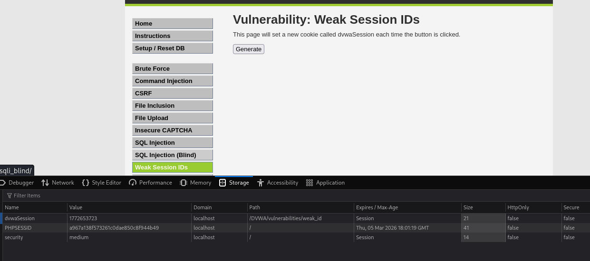

# DVWA - Vulnerability: Weak Session IDs

## Security Level: Medium
**Condition:** Cookie value is set using the `time();` method.

---

### 1. Descripción del Escenario
En este nivel de dificultad, la aplicación intenta generar un identificador de sesión que no sea un simple contador secuencial (como en el nivel bajo). Sin embargo, utiliza una función de PHP predecible: `time()`.

Esta función devuelve el momento actual medido como el número de segundos transcurridos desde la Época Unix (1 de enero de 1970 00:00:00 GMT).

### 2. Análisis de la Captura
Al inspeccionar las cookies del navegador (Storage Tab), observamos lo siguiente:

* **Cookie Name:** `dvwaSession`
* **Value:** `1772653723` (Este número representa un timestamp Unix).
* **PHPSESSID:** Sigue siendo el ID de sesión principal de PHP, pero la aplicación confía en `dvwaSession` para su lógica interna.

### 3. Identificación de la Vulnerabilidad
El problema radica en la **predecibilidad**. Al usar el tiempo en segundos como factor de generación:
1.  **Fuerza Bruta Limitada:** Un atacante solo necesita conocer aproximadamente a qué hora un usuario hizo clic en "Generate" para adivinar su ID.
2.  **Sincronización:** Si un atacante genera una cookie y obtiene el valor $X$, sabe que la cookie generada un segundo después será exactamente $X + 1$.

### 4. Prueba de Concepto (PoC)
Para demostrar la debilidad, se pueden seguir estos pasos:
1.  Presionar el botón **Generate** y anotar el valor de la cookie `dvwaSession`.
2.  Esperar exactamente 10 segundos y presionar de nuevo.
3.  Verificar que el nuevo valor es el anterior + 10.
4.  Un atacante podría automatizar un script para iterar sobre timestamps recientes y secuestrar sesiones de otros usuarios activos.

### 5. Recomendación de Mitigación
Para corregir esto, los IDs de sesión deben ser generados mediante funciones aleatorias criptográficamente seguras que no dependan de factores predecibles como el tiempo del sistema.

* **Mal:** `Set-Cookie: dvwaSession=time();`
* **Bien:** Usar `session_id()` nativo de PHP o funciones como `random_bytes()` para generar tokens de alta entropía.

---
[!WARNING]
*Documentación generada para propósitos educativos en entornos controlados.*
