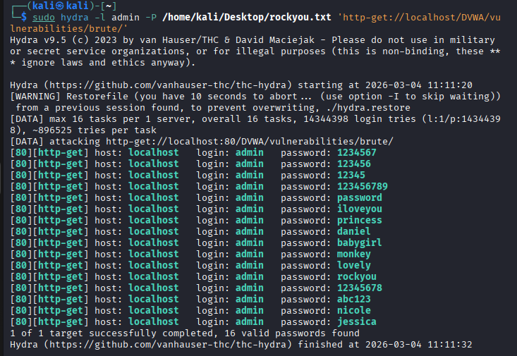

# Reporte de Explotación: Fuerza Bruta (Nivel: Medio) - DVWA

Este documento detalla la auditoría de seguridad realizada sobre el módulo de **Brute Force** de la aplicación **DVWA**, configurada en nivel de seguridad **Medium**.

---

## 🔍 Análisis de la Vulnerabilidad

En el nivel de seguridad **Medio**, la aplicación intenta mitigar ataques automatizados mediante la función `sleep()` en el backend.

* **Mecanismo de Defensa:** El servidor introduce un retraso deliberado de **2 a 3 segundos** cada vez que se introduce una contraseña incorrecta.
* **Debilidad:** Aunque el ataque es más lento, la aplicación no bloquea la IP ni la cuenta tras múltiples intentos fallidos (falta de *Account Lockout*), permitiendo que un atacante con paciencia obtenga las credenciales.
* **Método:** Sigue utilizando peticiones **GET**, lo que facilita la interceptación y el envío de parámetros por URL.

---

## 🛠️ Configuración del Ataque

Para evadir el retraso y obtener la contraseña del usuario `admin`, se utilizó **THC-Hydra v9.3** con el diccionario estándar `rockyou.txt`.

### Comando Utilizado:
```bash
hydra -l admin -P /usr/share/wordlists/rockyou.txt 'http-get-form://127.0.0.1/vulnerabilities/brute/:username=^USER^&password=^PASS^&Login=Login:S=Welcome:H=Cookie\: PHPSESSID=j422143437vlsdgqs0t1385420; security=medium'

### Parámetros Técnicos

-l admin --> Define el usuario objetivo.
-P [path] --> Carga la lista de palabras (Wordlist) para las contraseñas.
http-get --> Indica que los datos se envían por GET a través de un formulario.
^USER^ /
^PASS^ --> Marcadores de posición que Hydra reemplaza por cada intento.
S=Welcome --> Condición de éxito: El login es válido si la respuesta HTTP contiene la cadena "Welcome".
H=Cookie... --> Cabecera crítica: Inyecta la sesión activa y el nivel de seguridad "medium" para que el servidor procese la petición correctamente.

## 📊 Resultados

A pesar de que el ataque tomó significativamente más tiempo que en el nivel **Low** (debido al retraso de 2-3 segundos por intento fallido implementado en el servidor), el proceso finalizó con éxito. La herramienta **Hydra** logró filtrar las combinaciones hasta identificar la credencial válida.

### Captura de la Ejecución Exitosa:



---

### Resumen del Resultado:

* **Target:** `127.0.0.1` (localhost)
* **Usuario:** `admin`
* **Contraseña encontrada:** `password`
* **Estado:** Explotado con éxito.

---

## 🛡️ Recomendaciones de Remediación

Para corregir esta vulnerabilidad de manera definitiva y elevar el nivel de seguridad a **Alto** o **Imposible**, se recomienda aplicar las siguientes medidas:

1.  **Anti-CSRF Tokens:** Incluir tokens dinámicos y únicos en cada petición. Esto rompe la automatización simple, ya que el atacante tendría que extraer un token nuevo para cada intento de contraseña.
2.  **Bloqueo de Cuenta (Account Lockout):** Implementar un límite estricto (ej. 3 a 5 intentos fallidos) que bloquee la cuenta o la IP del solicitante durante un periodo de tiempo determinado.
3.  **CAPTCHA:** Obligar al usuario a resolver un desafío visual (como reCAPTCHA) tras el segundo o tercer intento fallido para asegurar que la interacción es humana.
4.  **Uso Obligatorio de POST:** Cambiar el método de envío de credenciales de `GET` a `POST`. Esto evita que las contraseñas queden expuestas en los logs del servidor, en el historial del navegador o en las capturas de tráfico de red de forma tan trivial.

---

> [!IMPORTANT]
> **Nota de Seguridad:** Este ejercicio se realizó en un entorno controlado con fines exclusivamente educativos y éticos. El acceso no autorizado a sistemas informáticos es ilegal y conlleva consecuencias legales.
